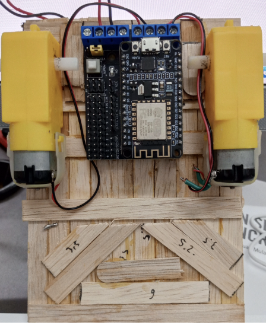
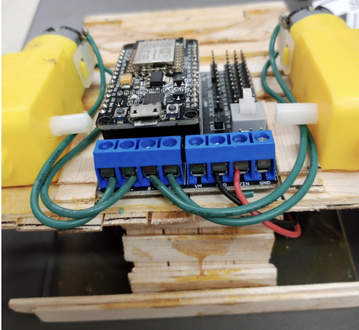

# WiFi-Controlled Sumobot (NodeMCU ESP8266)

This project is a WiFi-controlled mobile sumobot designed for embedded systems learning and robotics experimentation. The robot is remotely operated via WiFi, demonstrating core concepts of IoT communication, motor control, and lightweight mechanical design.

---

## Hardware Architecture

The system is built using only two main electronic modules:

- NodeMCU ESP8266 (WiFi-enabled microcontroller)
- L293D Motor Driver Shield for NodeMCU
- Dual DC motors (differential drive)

The L293D Motor Driver Shield simplifies wiring by removing the need for jumper cables. The NodeMCU ESP8266 is directly mounted onto the shield’s socket, resulting in a compact and modular hardware setup.

---

## Communication & Control Logic

The system uses an HTTP-based command interface:
- A web server (ESP8266WebServer) listens for incoming requests
- Commands are parsed via query parameters (State)
- Each command maps to a specific motion function

- F → Forward
- B → Backward
- L / R → Turning
- S → Stop

---

## Motion Control Logic

Motor behavior is implemented using:
- Direction pins (DIR_A, DIR_B) → control rotation direction
- PWM signals (PWM_A, PWM_B) → control speed
  
Differential speed control enables:
- turning (asymmetric motor speeds)
- directional movement
- smooth transitions between states

## Mechanical Design Constraints

The robot follows strict sumobot competition requirements:

### Materials Used
- 50 ice cream sticks (primary structural framework)
- Acrylic sheet (15 cm × 10 cm × 2 mm)
- Aibon glue (adhesive)

### Size Limitation
- Maximum dimensions: **15 cm × 15 cm**

### Weight Limitation
- Maximum total mass: **500 grams**
- Includes batteries and additional weights (excluding remote controller)

### Structural Rules
- Ice cream sticks are used as the main structural material
- Acrylic sheets are used only for reinforcement and non-structural support

---

## Key Highlights

- Minimal hardware design using only essential components
- Modular plug-and-play integration using motor driver shield
- No jumper wire complexity
- Real-time WiFi-based robot control via NodeMCU ESP8266
- Lightweight mechanical design optimized for competition constraints
- Practical implementation of embedded systems and IoT control

---
## Project Gallery

  
  

